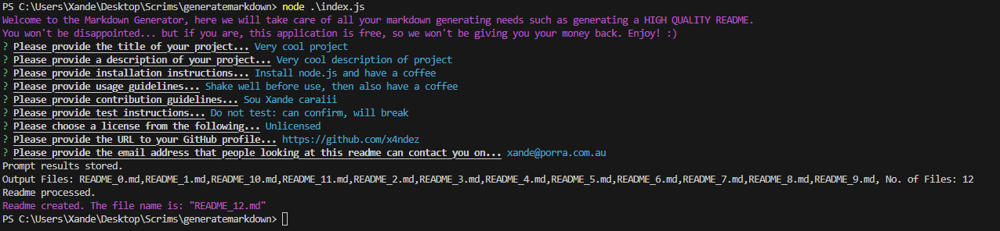

# README Generator



## Description
This application is the week 9 project of the edX/Monash bootcamp. The focus of this week is node.js; I used the inquirer-promise module to form the prompt to collect user input, the file system module, path module and made my own module that contains the readme template.  I found most of this project on the easy side, but then I thought I understood promises with async and await... I didn't understand it. It took me hours upon hours trying to understand it, messing with different variations.  Moods changed from "I'll just try this", then reverting commits, try again, staring at my screen, back to square one... and then I finally gave in to watching a Youtube video, and I understood it within 10 minutes.  And that is the story of how I have beautiful clean async/await and function structure in my index.js!  Thanks Youtube!  If I was to redo this project, something I would have liked to do is: instead of a template readme, have them segmented into their sections so that I could omit the section by not adding that string to the processed template.  It would also be nice to add a feature where the user could add their own section via the command prompt.

The acceptance criteria of this project were as follows:

```md
GIVEN a command-line application that accepts user input
WHEN I am prompted for information about my application repository
THEN a high-quality, professional README.md is generated with the title of my project and sections entitled Description, Table of Contents, Installation, Usage, License, Contributing, Tests, and Questions
WHEN I enter my project title
THEN this is displayed as the title of the README
WHEN I enter a description, installation instructions, usage information, contribution guidelines, and test instructions
THEN this information is added to the sections of the README entitled Description, Installation, Usage, Contributing, and Tests
WHEN I choose a license for my application from a list of options
THEN a badge for that license is added near the top of the README and a notice is added to the section of the README entitled License that explains which license the application is covered under
WHEN I enter my GitHub username
THEN this is added to the section of the README entitled Questions, with a link to my GitHub profile
WHEN I enter my email address
THEN this is added to the section of the README entitled Questions, with instructions on how to reach me with additional questions
WHEN I click on the links in the Table of Contents
THEN I am taken to the corresponding section of the README
```

## Table of Contents

1. [Installation](#installation)
2. [Usage](#usage)
3. [License](#license)
4. [Contribution](#contribution)
5. [Tests](#tests)
6. [Questions](#questions)

## Installation
To use this application you will need [node.js](https://nodejs.org/en) installed.

## Application Walkthrough
Please click [here](https://drive.google.com/file/d/1s3Kol9xhRSuTMolz6MIRMKd3ep7-Xtgy/view?usp=drive_link) to see the video walkthrough of README Generator.
## Usage
1. Execute 'node index.js' in the './generatemarkdown/' directory.
2. Type or paste in your information when prompted.
3. When "Readme created" is output to the terminal, with the file name specified, the readme file will be placed into the './output/' directory.
4. Take a screenshot of your deployed application and place it in './assets/screenshot.png'.
5. Make specific changes as needed.
6. Once the file is in your working directory, rename it to README.md.

## License
<br>
This project is covered under the MIT License.

## Contribution
x4ndez: <https://github.com/x4ndez>
