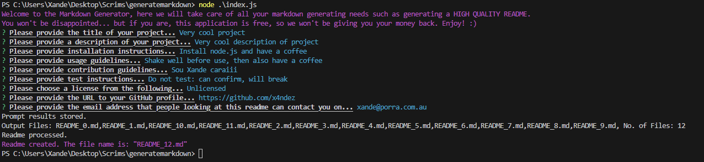

    
    # x

    <!-- Please take a screenshot of the deployed application and place it in ./assets/images/ -->
    
    
    ## Description
    x

    ## Table of Contents
    
    1. [Installation](#installation)
    2. [Usage](#usage)
    3. [License](#license)
    4. [Contribution](#contribution)
    5. [Tests](#tests)
    6. [Questions](#questions)
    
    ## Installation
    x
    
    ## Usage
    x
    
    ## License
     
    This project is covered under the MIT License.
    
    ## Contribution
    x
    
    ## Tests
    x
    
    ## Questions
    GitHub Profile: <x> 
    Any questions can be directed to... <x>.

    